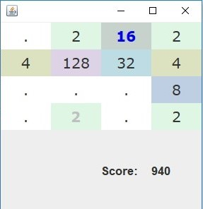

# enjoy2048
This application is a simple, Swing-based "2048" game. If you're not familiar with "2048", please refer to this link ( https://en.wikipedia.org/wiki/2048_(video_game)).

You can start the program by running <code> Play.main() </code> without a command line argument.

Enjoy 2048!
